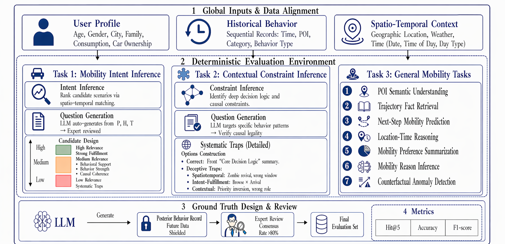
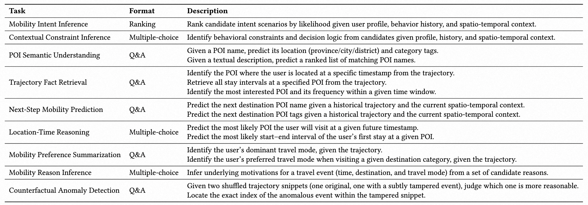

# LBS-IntentBench

**A Real-World Benchmark for Implicit Intent Inference and Spatio-temporal Reasoning**

[](LICENSE)
---

## Overview

**LBS-IntentBench** is a benchmark built on large-scale anonymized real-world user trajectories, specifically designed for evaluating LLMs on implicit intent understanding and spatio-temporal reasoning in Location-Based Services (LBS) recommendation.

<p align="center">
  
</p>

The benchmark is organized around an **Intent–Decision–Fact** hierarchy comprising three complementary tasks:

| Task | Name | Description | Format |
|:-----|:-----|:------------|:-------|
| **Task 1** | Mobility Intent Inference (MII) | Rank candidate intent scenarios by likelihood given user profile, behavior history, and spatio-temporal context | Ranking |
| **Task 2** | Contextual Constraint Inference (CCI) | Identify behavioral constraints and decision logic from candidates given profile, history, and spatio-temporal context. | Multiple-choice |
| **Task 3** | General Mobility Tasks (GMT) | 7 subtasks covering POI understanding, trajectory retrieval, next-step prediction, preference summarization, and more | Q&A / Multiple-choice |

<p align="center">
  
</p>

---

## Evaluation

Evaluation scripts for **Task 3 (GMT)** are fully released. Scripts for
**Task 1 (MII)** and **Task 2 (CCI)** will be released after internal review.

You can evaluate your Task 3 model predictions (JSONL) using:

```bash
# POI Semantic Understanding requires --direction (forward | backward)
python scripts/run_evaluation.py \
    --task task3_gmt \
    --subtask poi_semantic_understanding \
    --direction forward \
    --predictions path/to/your_predictions.jsonl \
    --ground-truth data/task3_gmt/poi_semantic_understanding.csv

# Other Task 3 subtasks do not need --direction
python scripts/run_evaluation.py \
    --task task3_gmt \
    --subtask next_step_mobility_prediction \
    --predictions path/to/your_predictions.jsonl \
    --ground-truth data/task3_gmt/next_step_mobility_prediction.csv
```

The full list of supported `--subtask` values:
`poi_semantic_understanding`, `trajectory_fact_retrieval`,
`next_step_mobility_prediction`, `location_time_reasoning`,
`mobility_preference_summarization`, `mobility_reason_inference`,
`counterfactual_anomaly_detection`.

---

## Project Structure

```
LBS-IntentBench/
├── data/                              # Benchmark datasets
│   ├── task1_mii/
│   │   └── mobility_intent_inference.csv
│   ├── task2_cci/
│   │   └── contextual_constraint_inference.csv
│   └── task3_gmt/                     # 7 subtask CSV files
│       ├── poi_semantic_understanding.csv
│       ├── trajectory_fact_retrieval.csv
│       ├── next_step_mobility_prediction.csv
│       ├── location_time_reasoning.csv
│       ├── mobility_preference_summarization.csv
│       ├── mobility_reason_inference.csv
│       └── counterfactual_anomaly_detection.csv
├── prompts/                           # Prompt templates
│   ├── task1_mii/                     # To be released after internal review
│   ├── task2_cci/                     # To be released after internal review
│   └── task3_gmt/
│       ├── poi_semantic_understanding.json        # PSU forward prompt
│       ├── poi_name_guess.json                    # PSU backward prompt
│       ├── trajectory_fact_retrieval.json
│       ├── next_step_mobility_prediction.json
│       ├── location_time_reasoning.json
│       ├── mobility_preference_summarization.json
│       ├── mobility_reason_inference.json
│       ├── counterfactual_anomaly_detection.json
│       └── counterfactual_snippet_construction.json  # Data construction prompt (not used at evaluation time)
├── evaluation/                        # Evaluation scripts
│   ├── task1_mii.py                   # To be released after internal review
│   ├── task2_cci.py                   # To be released after internal review
│   └── task3_gmt/                     # 7 subtask evaluation scripts (fully available)
│       ├── _common.py
│       ├── poi_semantic_understanding.py
│       ├── trajectory_fact_retrieval.py
│       ├── next_step_mobility_prediction.py
│       ├── location_time_reasoning.py
│       ├── mobility_preference_summarization.py
│       ├── mobility_reason_inference.py
│       └── counterfactual_anomaly_detection.py
├── scripts/
│   └── run_evaluation.py              # Unified evaluation entry point (currently dispatches Task 3 only)
└── docs/                              # Documentation
    └── metrics.md
```
---

## License

This project is licensed under the [Creative Commons Attribution-NonCommercial 4.0 International License (CC BY-NC 4.0)](LICENSE).
