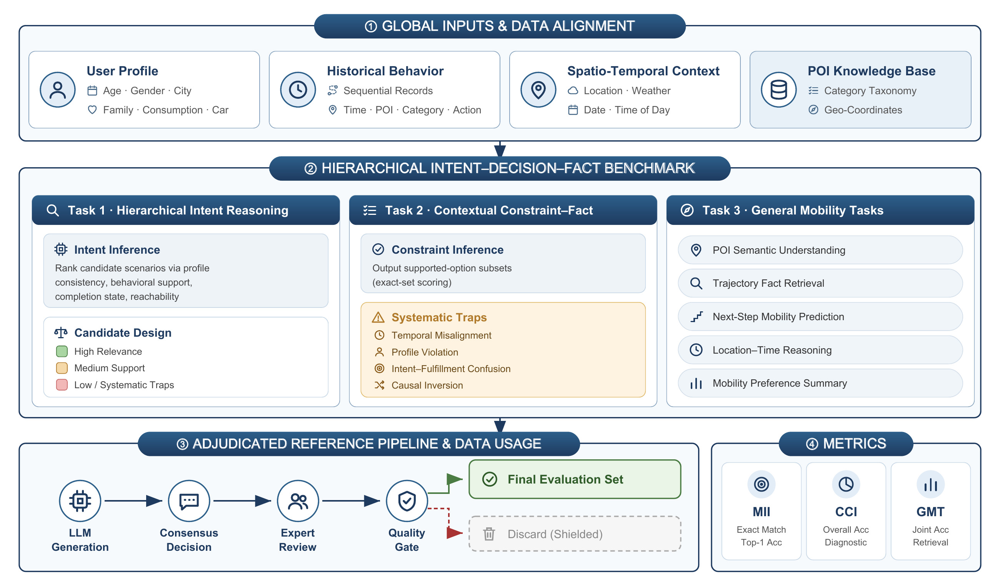
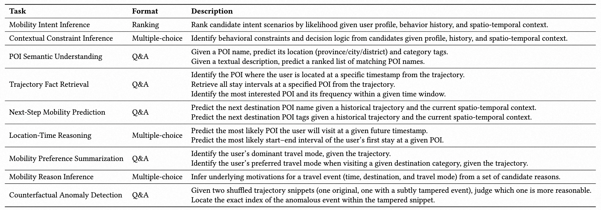

# LBS-IntentBench

**A Real-World Benchmark for Implicit Intent Inference and Spatio-temporal Reasoning in Location-Based Services**

[](LICENSE)
[](https://www.python.org/)

## Overview

LBS-IntentBench evaluates language models on implicit mobility intent understanding and spatio-temporal reasoning. It contains three complementary task groups organized as an **Intent–Decision–Fact** hierarchy.

<p align="center">
  
</p>

| Task | Name | Output | Capability |
|:--|:--|:--|:--|
| Task 1 | Mobility Intent Inference (MII) | Complete ranking | Rank plausible future intents from profile, history, and current context |
| Task 2 | Contextual Constraint Inference (CCI) | Supported option set | Identify interpretations consistent with behavioral and spatio-temporal constraints |
| Task 3 | General Mobility Tasks (GMT) | Q&A / choices | Evaluate seven factual mobility understanding and reasoning capabilities |

Task 3 covers POI Semantic Understanding, Trajectory Fact Retrieval, Next-Step Mobility Prediction, Location–Time Reasoning, Mobility Preference Summarization, Mobility Reason Inference, and Counterfactual Anomaly Detection.

<p align="center">
  
</p>

## What is included

| Content | Location |
|:--|:--|
| Processed evaluation instances and reference answers | [`data/`](data/) |
| Evaluation and public construction prompts | [`prompts/`](prompts/) |
| Deterministic task scorers | [`evaluation/`](evaluation/) |
| Unified evaluation command | [`scripts/run_evaluation.py`](scripts/run_evaluation.py) |

The release does not include raw mobility records, private identifier mappings, paper model outputs, or experiment result files.

## Quick start

The evaluation code uses only the Python standard library. Python 3.9 or later is recommended.

```bash
git clone https://github.com/lbs-researcher/LBS-IntentBench.git
cd LBS-IntentBench
```

Predictions use JSONL with one object per line. For example, a Task 1 prediction is:

```json
{"sample_id": "<id-from-data>", "predicted_ranking": "A>B>C"}
```

Run the scorer with:

```bash
python scripts/run_evaluation.py \
  --task task1_mii \
  --predictions path/to/predictions.jsonl \
  --ground-truth data/task1_mii/mobility_intent_inference.csv
```

Task 2 uses `--task task2_cci` and the following prediction format:

```json
{"sample_id": "<id-from-data>", "predicted_options": "A,C"}
```

For Task 3, also specify a subtask:

```bash
python scripts/run_evaluation.py \
  --task task3_gmt \
  --subtask next_step_mobility_prediction \
  --predictions path/to/predictions.jsonl \
  --ground-truth data/task3_gmt/next_step_mobility_prediction.csv
```

POI Semantic Understanding additionally requires `--direction forward` or `--direction backward`. See [Metrics](docs/metrics.md) for scorer outputs; task-specific prediction fields are documented in the corresponding evaluator modules.

## Repository structure

```text
LBS-IntentBench/
├── data/                         # Released benchmark instances
├── prompts/                      # Evaluation and construction prompts
├── evaluation/                   # Official scorers
├── scripts/                      # Unified evaluation command
└── docs/                         # Metric reference
```

## License

This project is released under the [Creative Commons Attribution-NonCommercial 4.0 International License](LICENSE).
